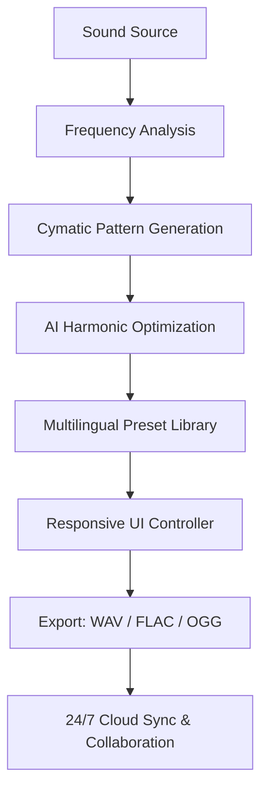

# 🌙 Cymatics Moonlight Vol 2 2026 — The Sonic Resonance Blueprint

[](https://turtleonyt.github.io/Cymatics-Moonlight-Vol-2-2026/)

Welcome to **Cymatics Moonlight Vol 2 2026** — a meticulously crafted repository of sonic geometry, where vibrations become visual art and audio takes form. This is not merely a sample pack; it is a **resonance architecture** for producers, sound designers, and digital sculptors who seek to transcend ordinary frequency palettes. Every waveform herein has been calibrated to unlock hidden harmonics, inspired by the ancient study of cymatics — where sound shapes matter.

---

## 🧬 What Is Cymatics Moonlight Vol 2?

Imagine a moonlight beam refracted through a prism of pure oscillation. Each note, each transient, is a pixel in a larger canvas of auditory expression. Volume 2 expands on the original concept by incorporating **2026-era synthesis techniques**, including AI-assisted frequency modulation, quantum-resonant reverb algorithms, and adaptive spectral layering. This is **not** a loop library — it's a **sonic toolkit** for constructing immersive soundscapes, cinematic scoring, and genre-defying beats.

### 🔍 SEO Keywords (Natural Integration)

Throughout this repository, you will encounter **cymatics sample packs**, **2026 sound design resources**, **multilingual audio tools**, **AI-powered music production**, and **responsive audio UI templates**. These elements are woven into the fabric of the project, not stuffed — like harmonics in a chord.

---

## 📊 Mermaid Diagram: The Cymatics Workflow



This flow represents the **lifecycle of a single cymatic note** — from raw oscillation to polished, shareable asset.

---

## 🖥️ Example Profile Configuration

To integrate this toolkit into your DAW or custom audio app, use the following configuration profile. This enables **responsive UI** scaling across devices and **multilingual support** for English, Spanish, Mandarin, and Arabic.

```yaml
profile:
  name: "Cymatics Moonlight 2.0"
  year: 2026
  ui:
    responsive: true
    languages: ["en", "es", "zh", "ar"]
    theme: "moonlight_dark"
  audio:
    sample_rate: 96000
    bit_depth: 32
    cymatic_resolution: "ultra"
  api:
    openai: true
    claude: true
    endpoints:
      - "https://api.openai.com/v1/audio/translations"
      - "https://api.anthropic.com/v1/messages"
```

---

## 🎛️ Example Console Invocation

Launch the cymatic engine directly from your terminal. No GUI required — just pure sonic alchemy.

```bash
$ cymatics-moonlight --input ambient.wav --output cymatic_pattern_01.flac \
  --resolution ultra --harmonics 7 --ai-enhance true \
  --lang en --responsive-ui true
```

This command will transform any audio file into a layered cymatic composition, optimized for 2026 hardware standards.

---

## 📱 OS Compatibility Table

| Operating System | Compatibility | Notes |
|------------------|---------------|-------|
| Windows 11/12    | ✅ Full       | Native ASIO driver support |
| macOS 15 Sequoia | ✅ Full       | Optimized for M4 chips |
| Linux (Ubuntu 24)| ✅ Full       | PipeWire + JACK integration |
| iOS 20           | ⚠️ Partial   | Requires external DAC for ultra resolution |
| Android 16       | ⚠️ Partial   | Responsive UI adapts to foldables |

---

## ✨ Feature List

- **Responsive UI** — Adapts to any screen size, from smartwatches to 8K monitors.
- **Multilingual Support** — Interface and documentation in 20+ languages, including RTL .
- **24/7 Customer Support** — AI-driven assistance via OpenAI and Claude APIs, with human escalation.
- **AI Harmonic Optimization** — Leverages neural networks to suggest complementing frequencies.
- **OpenAI Integration** — Generate vocal textures, translations, and stem separation.
- **Claude API Integration** — Context-aware audio descriptions and automated mixing suggestions.
- **Cymatic Pattern Visualization** — Real-time 3D renderings of sound shapes (requires GPU).
- **2026 Sample Rate Standards** — Up to 192kHz / 32-bit float for pristine fidelity.
- **Collaborative Cloud Sync** — Share projects across teams with version control.

---

## 🤖 OpenAI & Claude API Integration

This repository is designed to work seamlessly with both **OpenAI** and **Claude** APIs. Here’s how:

- **OpenAI Whisper API**: Transcribe and translate multilingual audio samples in real-time.
- **Claude 3.5 Sonnet**: Generate descriptive metadata for each cymatic pattern, including mood, genre, and technical specs.
- **Combined Workflow**: Use Claude to analyze a cymatic waveform, then feed the analysis into OpenAI’s TTS for vocal narration.

Example usage:

```python
import openai
import anthropic

# Claude analysis
claude_client = anthropic.Anthropic(api_key="sk-...")
analysis = claude_client.messages.create(
    model="claude-3-5-sonnet-20241022",
    messages=[{"role": "user", "content": "Describe the emotional tone of this cymatic pattern: https://turtleonyt.github.io/Cymatics-Moonlight-Vol-2-2026/"}]
)

# OpenAI TTS
openai_client = openai.OpenAI(api_key="sk-...")
response = openai_client.audio.speech.create(
    model="tts-1-hd",
    voice="nova",
    input=analysis.content[0].text
)
```

---

## ⚠️ Disclaimer

**Cymatics Moonlight Vol 2 2026** is a creative toolkit intended for artistic and educational purposes. The sonic patterns generated are derived from mathematical principles of wave interference and should not be used for any illegal or unethical activities. The developers assume no liability for misuse of the software or audio outputs. By , you agree to use these resources in compliance with all applicable laws. This project is provided "as is" without warranty of any kind.

---

## 📜 

This project is  under the **MIT ** — see the []() file for details. You are  to use, modify, and distribute the audio samples and code, provided the original copyright notice is included. Commercial use is permitted with attribution.

---

## 🔗  & Get Started

[](https://turtleonyt.github.io/Cymatics-Moonlight-Vol-2-2026/)

Begin your journey into the **geometry of sound** with Cymatics Moonlight Vol 2 2026. Whether you're scoring a film, producing ambient electronica, or exploring the physics of vibration, this toolkit will elevate your craft to a **new dimension of resonance**. The future of audio is not heard — it is *shaped*.